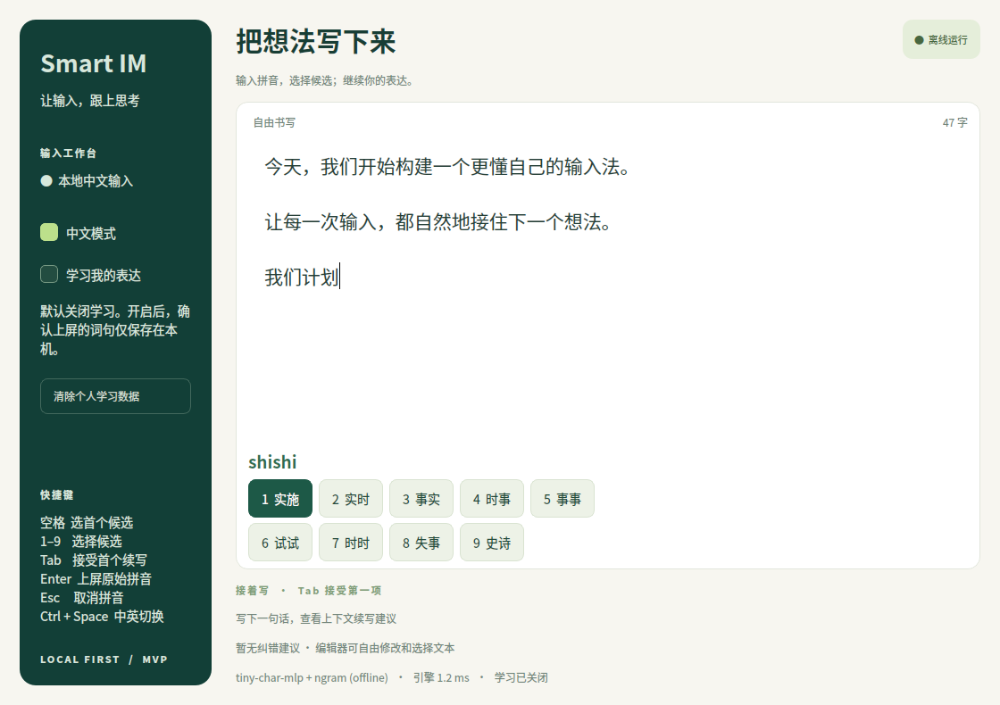

# 灵序 Smart IM

本地优先的 AI 中文输入法 MVP，Windows 为首发目标。包含跨平台原生桌面体验台、可复现的小型神经语言模型，以及 Windows 实验性跨应用候选浮窗。依赖安装完成后，运行不需要网络、云端大模型或 API key。



## 开始使用

Windows PowerShell，在项目目录执行：

```powershell
py -3 -m venv .venv
.\.venv\Scripts\python.exe -m pip install -e ".[desktop]"
.\.venv\Scripts\python.exe -m smart_im desktop
```

跨应用实验模式：先将系统键盘切换为英文，再运行：

```powershell
.\.venv\Scripts\python.exe -m smart_im windows
```

Ctrl+Space 开关中文，空格选首项，1–9 选词，Tab 接受续写，Enter 提交原拼音，Esc 取消。托盘右键退出。也可使用 [PowerShell 启动脚本](scripts/start.ps1)。完整步骤和已知兼容性边界见 [Windows 说明](docs/WINDOWS.md)。

Linux/macOS 可运行桌面体验台与核心 CLI：

```sh
uv sync --extra desktop --extra dev
uv run smart-im desktop
uv run smart-im suggest nihao
uv run smart-im suggest shishi --context 我们计划
uv run smart-im predict 我们
uv run smart-im correct 我以经完成需求分析
```

不使用 uv 时，可用 `python3 -m venv .venv`，激活后 `python -m pip install -e ".[desktop,dev]"`。

## 已实现

| 能力 | MVP 实现 |
|---|---|
| 中文拼音 | 2,275 条读音记录、1,306 个多字词组；全拼、简拼、组句、部分补全、音节分隔、ü/v/u: |
| AI 候选排序 | 词典与分词证据 + 本地模型条件概率 + 用户词频；完整词优先于未完成短语 |
| 下一词/短语 | 上下文后缀检索、本地模型排序、个人短语转移统计；Tab 确认 |
| 本地小模型 | 27,484 参数 NumPy 字符 MLP + n-gram；约 103 KiB 权重，自带训练脚本与自编语料 |
| 个人学习 | SQLite 词频和最多 8 字上下文后缀；默认关闭，可清空，重启保留 |
| 基础纠错 | 单步拼音容错与 14 条保守错词/搭配规则；语义纠错仅提供确认建议 |
| 桌面交互 | PySide6、后台推理、版本匹配、快速空格延迟确认、光标处插入与选择替换 |
| Windows 浮窗 | Ctrl+Space、低级键盘钩子、不抢焦点候选窗口、Unicode SendInput、托盘管理 |
| 扩展 | 独立 LanguageModel 协议、可选本地 GGUF 适配、统一 JSON CLI |

Windows 浮窗不是已注册的 TSF 输入法。当前开发环境为 Linux，Windows 接口只进行了平台无关逻辑/ABI 测试，仍需真机验收；未提供正式安装器。自带小模型用于验证输入闭环，有限词典和语料不能代表商用输入法的中文覆盖和语言质量。GGUF 接口未用真实外部权重做硬件验证。

## 本地学习

桌面左侧或 Windows 托盘开启“学习我的表达”；CLI 使用 `--learn`。学习关闭或单次 `--private` 时，候选与预测不读取、不写入个人统计。词频学习发生在用户确认上屏后，不记录原始按键流水。

```sh
smart-im --learn commit 实施 --pinyin shishi --context 我们计划
smart-im --learn suggest shishi --context 我们计划
smart-im --learn suggest shishi --private
smart-im stats
smart-im reset --yes
```

默认库：Windows `%LOCALAPPDATA%\SmartIM\learning.sqlite3`；Linux `$XDG_DATA_HOME/smart-im/learning.sqlite3`，未设置时使用 `~/.local/share`。可用全局参数 `--data-dir` 指定目录。数据为本地明文 SQLite；当前不是加密个人模型。CLI `stats` 可在学习关闭时显式查看已有记录数量。

## 架构与后续

```text
桌面编辑器 / Windows 浮窗
          ↓
组合输入状态机 → 拼音解码 → 引擎排序 → 候选 / 续写 / 纠错
                              ↑
                   LanguageModel + SQLite 个性化
                              ↑
                         用户确认反馈
```

- [整体架构与技术选型](docs/ARCHITECTURE.md)
- [分阶段实现与人工验收计划](docs/PLAN.md)
- [模型结构、训练和 GGUF 接入](docs/MODEL_CARD.md)
- [验证记录与延迟测量](docs/VALIDATION.md)

下一阶段：Windows TSF 原生服务、独立推理进程和超时取消、更大授权词库及独立质量评测集、Personal Language Model 适配训练。当前个人学习是统计适配，不是在线微调神经网络。

## 开发与验证

```sh
uv sync --extra desktop --extra dev
uv run pytest -q
uv run ruff check .
uv run smart-im benchmark --iterations 1000
uv run python scripts/benchmark.py --output docs/benchmark.json
uv run python scripts/train_tiny_lm.py
uv build
```

Qt 测试自动使用 offscreen，不需要显示器。仓库提供 Ubuntu/Windows CI 配置，但尚未在远端执行。所有模型资源包含在 wheel 内，安装后可离线推理。
