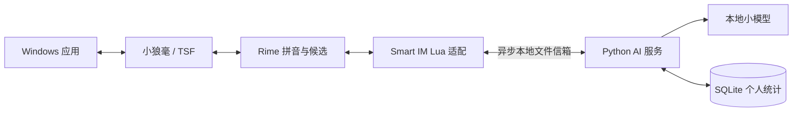

# 灵序 Smart IM

**Rime / 小狼毫 + 本地 AI 候选重排**。Rime 负责拼音、基础候选和上屏，Python 服务复用自带的小模型和 SQLite 个人统计。依赖安装后离线运行，不使用云端大模型。

这一版是最小可用接入：正常输入先显示 Rime 原始候选，后台算好后按 **Tab** 应用 AI 排序，再用空格或数字选词。服务关闭、结果过期或计算失败时保持原候选。没有自动刷新候选或突然改序。

## Windows 使用

先安装支持 `librime-lua` 的[小狼毫](https://github.com/rime/weasel)，并确保已有 `luna_pinyin` 词典/方案。项目不捆绑或修改小狼毫。

```powershell
py -3 -m venv .venv
.\.venv\Scripts\python.exe -m pip install -e .
.\.venv\Scripts\python.exe -m smart_im install-rime
```

在小狼毫“输入法设定”中勾选 **Smart IM**，然后重新部署并切换到该方案。安装命令只写本项目的 schema 和 Lua 文件，不改现有 `default.custom.yaml` 或 `rime.lua`。

```powershell
.\.venv\Scripts\python.exe -m smart_im serve
```

保持终端运行。先输入并确认“我们计划”，再输入 `shishi`，稍等片刻按 Tab，可观察“实施”的排序。没有前文时保留基础顺序是正常行为。结果未就绪时提示稍后再按 Tab，不阻塞打字。Ctrl+C 关闭服务后仍可正常使用基础输入。

完整步骤、依赖、学习开关和人工验收见 [Rime 使用说明](docs/RIME.md)。

## 架构与范围



- 只重排最多 9 个范围一致的原始候选，保留 Rime Candidate 对象及其元数据，不用模型替代拼音解码。
- 使用 Lua/Python 标准库文件信箱，无额外 Lua 网络依赖，无 HTTP 服务，也不在按键路径启动 Python 进程或等待模型。
- 学习默认关闭：服务 `--learn` 和方案“学习开启”都开启时才使用与写入个人统计。专用方案关闭 Rime 用户词典，避免两套学习重复计数。
- 上下文只来自当前 Rime 会话中本工具观察到的有限确认文本，不读取外部应用正文。会话不等于应用控件，焦点隔离还有限制。
- 自带 27,484 参数字符 MLP + n-gram 是有限语料基线；Rime 改善输入底座，不会自动提升模型语言能力。

本版不包含无拼音续写、文内灰字、外部文档语义改写、自动异步刷新、C++ 插件或 Personal LM 训练。已有预测与纠错继续保留在桌面体验台/CLI。当前开发环境为 Linux，Windows 小狼毫真机验收仍需执行。

## CLI 与演示工具

```sh
# 验证外部候选排序；输出原候选的零基索引排列
smart-im rerank 实时 事实 实施 --pinyin shishi --context 我们计划
# 自定义 Rime 目录（Linux 需显式指定所用前端的用户目录）
smart-im install-rime --user-dir /path/to/rime
smart-im serve --user-dir /path/to/rime
# 旧版独立桌面体验台，需要额外安装桌面依赖
python -m pip install -e ".[desktop]"
smart-im desktop
```

`suggest`、`predict`、`correct` 和旧的 `windows` 钩子浮窗仍可用于演示与回归测试，日常 Windows 输入主线是 Rime。桌面预览见 [截图](docs/desktop-preview.png)，旧浮窗说明见 [历史 Windows MVP](docs/WINDOWS.md)。

## 文档与验证

- [本次最小重构计划](docs/REFACTOR_PLAN.md)
- [当前架构](docs/ARCHITECTURE.md)
- [模型说明与可选 GGUF](docs/MODEL_CARD.md)
- [验证记录](docs/VALIDATION.md)

```sh
uv sync --extra dev --extra desktop
uv run pytest -q
uv run ruff check .
uv run ruff format --check .
uv build
```

测试包含真实 Lua 运行时与 Python 服务的协议整合，Qt 使用 offscreen。它们不等价于 Windows TSF 真机验收。本项目的 schema、Lua 适配、自带演示词典及模型资源都包含在 wheel 内；第三方 `luna_pinyin` 需另行安装。运行 Rime 服务不需要安装 PySide6。
