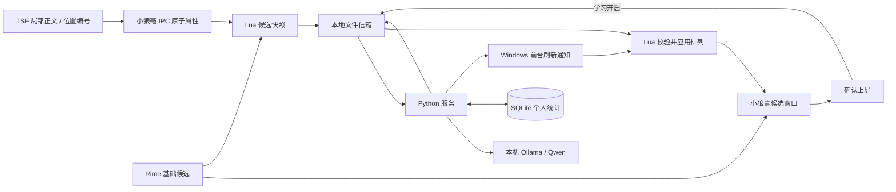

# Smart IM 架构

小狼毫提供 Windows TSF、组合输入、候选窗口与上屏；Rime 和 `luna_pinyin` 提供基础候选。Smart IM 通过本机 Ollama 调用 Qwen 选择候选，并管理可选 SQLite 个人统计。Python 运行时仅使用标准库。

## 模块职责

| 模块 | 职责 |
|---|---|
| `rime_assets/smart_im.schema.yaml` | 独立方案、词典引用和学习开关 |
| `rime_assets/lua/smart_im.lua` | 候选快照、自动重排、高亮推荐和确认事件 |
| `rime_protocol.py` | 有界消息解析和索引排列校验 |
| `rime_service.py` | 信箱轮询、单实例锁、心跳、异常回退及文件清理 |
| `rime_refresh.py` | Windows 前台与输入状态校验、候选刷新通知 |
| `rime_install.py` | 两个项目资源的安装、冲突预检和备份 |
| `engine.py` | 外部候选排序、确认学习、统计查询与清空 |
| `ranking.py` | 校验模型排列、叠加个人统计并保留稳定顺序 |
| `ollama_model.py` | 本机 Ollama 的最佳候选选择、限时请求与索引校验 |
| `personalization.py` | 有界 SQLite 词频和短上下文统计 |
| `cli.py` | `install-rime`、`serve`、`rerank`、`stats`、`reset` |

## 候选与交互

Lua 只缓冲前 9 个候选，从中选择与首候选 `start/_end` 一致的子集，并保留原始 Candidate 对象。重排只在子集原槽位间置换，不同范围的候选固定原位。快照包含输入、光标位置、会话上下文、学习状态、槽位映射和候选元数据。输入或快照变化使旧结果失效。

服务返回候选索引排列。Windows 服务写入结果后，以一对 `VK_SELECT` 通知小狼毫刷新；Lua 专门处理对应的 `Select` 事件，校验会话、版本、排列及完整候选快照后应用结果。推荐词移到首位，使用 Rime 原生选中高亮，候选栏提示“★ AI 推荐”；不包装或修改 Candidate 的注释、文本及学习元数据。无上下文且未学习的原序结果不标推荐。普通空格和数字继续使用当前显示顺序，Tab 交给 Rime 原有逻辑。无服务、错误结果和过期结果都保留基础候选。

刷新通知只由 Windows CLI 服务启用。请求首次出现时记录前台窗口、焦点及键盘布局；稳定窗口结束后重新校验，允许本次组合输入完成光标布局，并在按键松开后记录光标及最后输入时间。末字符仍按住时保留请求等待下次轮询，不提前计算一个无法通知的结果；焦点变化不会重新绑定旧请求。响应发布后再次确认请求未变化，且窗口、焦点、光标、输入状态均未改变、没有按键或鼠标按钮按住才发送通知。注入失败不重试、不影响基础输入；已完成结果仍可在下次候选重建时读取。这个机制复用[小狼毫自身鼠标选词的唤醒方式](https://github.com/rime/weasel/blob/master/WeaselTSF/CandidateList.cpp)，不安装键盘钩子，也不模拟 Tab 或确认键。其他前端没有停打时的主动唤醒。

`Engine.rerank(texts, context, pinyin, private, context_after="")` 返回零基排列，保留重复候选。默认由 `OllamaReranker` 通过本机 `/api/chat` 调用 `qwen3:1.7b`，关闭流式输出和思考，使用 JSON Schema 约束最佳索引。模型比较“前文 + 已选分段 + 候选 + 后文”短语，只输出 `{"best": index}`；客户端校验索引后构造完整排列，将最佳项提升到首位，其余保持 Rime 原序。

模型排列作为后续个人统计调整的基础顺序。无上下文时不调用模型；无上下文且无个人证据时保持 Rime 原序。超时、无效响应等错误由 Engine 整批回退，CLI 诊断命令返回非零退出码。HTTP 仅接受本机回环地址，忽略代理环境变量，不跟随重定向。模型接口与边界见 [模型说明](MODEL_CARD.md)。

## 本地信箱

Lua 和 Python 通过标准库读写用户目录下的 `smart_im_runtime`，不在输入路径启动进程或等待模型。默认轮询间隔为 20 ms，排序请求按实际内容稳定 80 ms 后才开始推理，减少连续按键的中间态请求。该等待使用单调时钟，不影响确认事件或心跳。文件系统和进程调度会增加响应时间。

消息上限为 16 KiB，最多 9 个候选；拼音、正文每一侧、已选前缀和单个候选分别限制为 96、128、128、64 个字符。`SMARTIM2` 排序请求与响应都携带上下文编号，正文前文、后文和已选分段分别编码；服务将前文与已选分段合并后截取末尾 128 字。`SMARTIM1` 仅作为旧服务调用和提交学习事件兼容接口。文本使用 UTF-8 十六进制编码，服务校验文件名、会话、版本和字段边界。编码只用于分隔消息，不提供加密。

每个会话的新排序请求覆盖旧请求；提交、取消、关闭 AI 等使快照失效时，Lua 删除该会话的请求和响应，避免继续计算未开始的废弃输入。Lua 也监听组合输入更新，在输入、光标或已选前缀变化时立即使旧快照失效。服务完成推理后再次检查请求是否存在且未变化，丢弃过期响应。已经开始的 HTTP 推理不会被抢占。确认事件使用独立文件，成功处理后在内存去重。协议文件 30 秒过期，正常退出清理本服务的临时文件。学习事件不提供跨进程重启的恰好一次交付保证。

服务持有目录级单实例锁；运行循环使用独立线程更新心跳，避免推理阻塞导致假离线。推理串行执行，每个会话只有一个可覆盖的请求文件；推理完成后复查是否仍为最新请求。Lua 在心跳过期时回退基础候选。文件重命名竞争、异常退出及真实输入延迟仍需在小狼毫环境验收。

## 学习与上下文

服务 `--learn` 与方案“学习开启”必须同时启用，才读取或保存个人统计；仅确认上屏触发记录。专用 schema 设置 `translator/enable_user_dict: false`，个人学习统一由 SQLite 管理。

小狼毫分支在 TSF 只读 edit session 中，从 selection 或当前 composition 的两端读取各最多 128 UTF-16 单元；截断边界的半个代理对会被丢弃。整个 composition（包括已选分段、拼音、inline preedit、非 inline 模式的占位空格）均不属于正文。Lua 另取候选前连续的 `kSelected` / `kConfirmed` 分段，无法完整恢复时不发重排请求。模型最终前文为 `(正文前文 + 已选分段)[-128:]`，后文单独传入；上屏学习只记录整句的正文前文后缀，避免再次包含已选分段。

上下文以单个 `smart_im_context` Rime 属性传递；空值表示失效。TSF 外部编辑、selection 变化、焦点和 context 栈变化撤销属性并隐藏旧候选，Lua 的 property notifier 同步删除信箱请求/响应并恢复基础候选。即使前后文文本相同，移动位置也会更换上下文编号。`InWriteSession` 用于区分小狼毫自身写入，组合显示变化不冒充正文变化。读取失败时不使用历史兜底。具体原生边界、协议和验收见 [TSF 扩展](TSF.md)。

安装只管理本项目两个资源；词典部署、方案切换和服务启动由用户完成。接口与安装方式见 [Rime 使用说明](RIME.md)，验证范围见 [验证记录](VALIDATION.md)。
