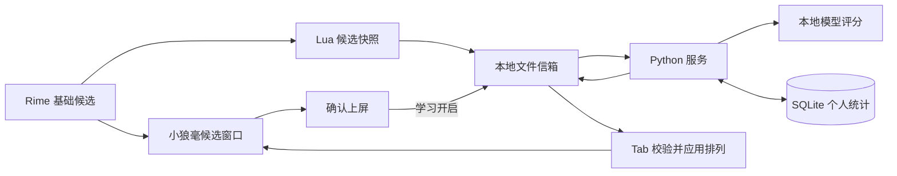

# Smart IM 架构

小狼毫提供 Windows TSF、组合输入、候选窗口与上屏；Rime 和 `luna_pinyin` 提供基础候选。Smart IM 负责候选重排和可选个人统计。

## 模块职责

| 模块 | 职责 |
|---|---|
| `rime_assets/smart_im.schema.yaml` | 独立方案、词典引用和学习开关 |
| `rime_assets/lua/smart_im.lua` | 候选快照、请求提交、Tab 重排和确认事件 |
| `rime_protocol.py` | 有界消息解析和索引排列校验 |
| `rime_service.py` | 信箱轮询、单实例锁、心跳、异常回退及文件清理 |
| `rime_install.py` | 两个项目资源的安装、冲突预检和备份 |
| `engine.py` | 外部候选排序、确认学习、统计查询与清空 |
| `ranking.py` | 原始顺序先验、模型上下文增益和个人统计加分 |
| `models.py` | 自带字符模型与 n-gram 评分 |
| `personalization.py` | 有界 SQLite 词频和短上下文统计 |
| `cli.py` | `install-rime`、`serve`、`rerank`、`stats`、`reset` |

## 候选与交互

Lua 只缓冲前 9 个范围一致的候选，并保留原始 Candidate 对象。快照包含输入、光标位置、会话上下文、学习状态和候选元数据。输入或快照变化使旧结果失效。

服务返回候选索引排列。后台完成不会改变正在显示的顺序；Tab 校验会话、版本和排列后才应用结果。普通空格和数字继续使用当前显示顺序。无服务、错误结果和过期结果都保留基础候选。

`Engine.rerank(texts, context, pinyin, private)` 返回零基排列，保留重复候选。评分结合 Rime 顺序先验、模型相对空上下文的有限增益及可选个人统计。无上下文且无个人证据时保持原序；模型失败时整批回退。

## 本地信箱

Lua 和 Python 通过标准库读写用户目录下的 `smart_im_runtime`，不在输入路径启动进程或等待模型。默认轮询间隔为 20 ms，文件系统和进程调度会增加响应时间。

消息上限为 16 KiB，最多 9 个候选；拼音、上下文和单个候选分别限制为 96、128、64 个字符。文本使用 UTF-8 十六进制编码，服务校验文件名、会话、版本和字段边界。编码只用于分隔消息，不提供加密。

每个会话的新排序请求覆盖旧请求；服务完成推理后再次检查请求是否变化。确认事件使用独立文件，成功处理后在内存去重。协议文件 30 秒过期，正常退出清理本服务的临时文件。学习事件不提供跨进程重启的恰好一次交付保证。

服务持有目录级单实例锁并更新心跳。Lua 在心跳过期时回退基础候选。文件重命名竞争、异常退出及真实输入延迟仍需在小狼毫环境验收。

## 学习与上下文

服务 `--learn` 与方案“学习开启”必须同时启用，才读取或保存个人统计；仅确认上屏触发记录。专用 schema 设置 `translator/enable_user_dict: false`，个人学习统一由 SQLite 管理。

会话历史最多保留 128 字，持久统计只使用最多 8 字的上下文后缀。模式切换、可观察的导航操作、应用属性变化和超时会清空历史。同一应用内的鼠标移动或控件切换不一定可见，因此会话历史不能代表实际编辑位置周围的文本。

安装只管理本项目两个资源；词典部署、方案切换和服务启动由用户完成。接口与安装方式见 [Rime 使用说明](RIME.md)，验证范围见 [验证记录](VALIDATION.md)。
