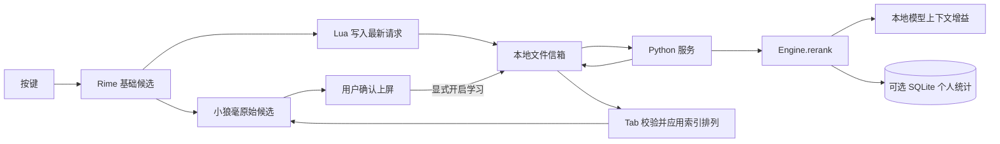

# Smart IM 架构（Rime MVP）

## 当前主线

小狼毫提供 Windows TSF、原生组合输入、候选窗口与上屏；librime 和已有 `luna_pinyin` 词典提供基础中文输入。Smart IM 只增强候选排序与个人统计，不 fork 输入法前端。

## 职责

| 文件/模块 | 职责 |
|---|---|
| `rime_assets/smart_im.schema.yaml` | 独立 Rime 拼音方案；复用词典；关闭 Rime 用户词典 |
| `rime_assets/lua/smart_im.lua` | 候选快照、后台请求、Tab 重排、确认事件；保留原候选对象 |
| `rime_protocol.py` | 有大小限制的版本化消息与索引排列 |
| `rime_service.py` | 本地信箱轮询、单实例锁、心跳、异常回退、事件消费与清理 |
| `rime_install.py` | 安装两个本项目资源；冲突预检和备份；不改其他方案 |
| `ranking.py` | 保留原始顺序的先验 + 有界模型上下文增益 + 可选个人证据 |
| `engine.py` | 外部 `rerank` / `commit_external`，以及保留的旧演示 API |
| `models.py` / `personalization.py` | 复用本地模型与 SQLite，不重新设计模型系统 |
| `decoder.py` / `session.py` / `desktop.py` / `windows.py` | 原有独立演示、测试与回归基线，不进入 Rime 主输入链路 |

## 本版的关键取舍

**显式 Tab 重排。** Rime 插件执行与前端刷新有同步生命周期约束。为避免修改小狼毫或新增 C++ 桥接，本版不主动从后台刷新候选。每次候选变化提交新的后台请求；只有 Tab 才应用匹配版本的结果，普通空格或数字保持当前显示顺序。

**文件信箱。** Lua 标准库即可访问，安装后只需一个 Python 进程。I/O 在按键路径仅处理有界小文件；推理在独立进程。它不是零延迟通道，默认服务轮询约 20 ms，磁盘和杀毒软件可能增加开销。未来需要自动刷新时再更换 IPC/前端事件机制。

**返回索引，不重造候选。** Rime 候选包含范围和来源信息。服务只返回索引排列；Lua 保留原对象，并且只允许同一范围的有限候选参与排序。异常、过期、不合法排列均保留原序。

**本版统一由 SQLite 学习。** 专用 schema 设置 `translator/enable_user_dict: false`；AI 服务与方案开关必须同时开启才使用或保存个人统计。未来需要 Rime 自带词频学习时，应重新划分统计职责，不能直接重复叠加。

**上下文只是有限会话历史。** 不承诺获得 Word、浏览器等应用正文，也不把 Rime 会话当作可靠的编辑控件边界。导航/模式切换等可观察事件会失效上下文，但同一应用内鼠标移动等仍可能无法检测。此局限与 Windows 人工验收一起公开。

## 扩展边界

`Engine.rerank(texts, context, pinyin, private)` 接受外部候选并返回零基排列；`commit_external` 只在确认后记录。`LanguageModel` 接口仍可替换本地模型或 Personal LM。独立程序的 `suggest/predict/correct` 保留，但本版 Rime 不接入生成式续写或全文纠错。

当前不添加服务注册/自动启动、插件管理框架、远程 API、模型下载器或训练平台。

## 官方参考

- [librime 架构与源码](https://github.com/rime/librime)
- [小狼毫 Windows 前端](https://github.com/rime/weasel)
- [librime-lua 脚本接口](https://github.com/hchunhui/librime-lua/wiki/Scripting)
- [librime-lua 对象接口](https://github.com/hchunhui/librime-lua/wiki/Objects)
