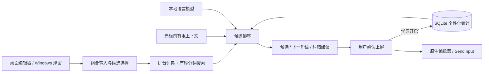

# 灵序 Smart IM — 架构设计

## 目标与边界

首发 Windows，完全本地运行。MVP 提供可独立运行的桌面体验台，以及基于 Windows 键盘钩子和 Unicode SendInput 的实验性跨应用候选浮窗。后者不是已注册的 Windows TSF 输入法；完整 TSF COM Text Service、安装签名和安全输入控件识别是下一阶段工作。Linux 环境可验证核心、Qt 界面及 Windows 平台无关逻辑，不能替代真机兼容性验收。

不使用云端推理，不自动下载权重。默认关闭长期学习，用户开启后只学习明确选中的候选和有限上下文统计，不记录原始键盘流水。系统浮窗只能使用自身确认输入的当前窗口会话上下文，不读取外部应用内容。桌面体验台使用编辑光标之前的文本。

## 数据流

## 模块与接口

| 模块 | 职责 | 实现 |
|---|---|---|
| `types.py` | 稳定候选、建议与 LanguageModel 契约 | 不依赖 UI |
| `decoder.py` | 全拼、简拼、分词、部分拼音、有限拼写容错 | 自带词典；pypinyin 校验新词和多音字；限制搜索宽度 |
| `models.py` | 候选条件概率、短语续写 | 自带 NumPy 小型神经语言模型与统计基线；可选本地 GGUF |
| `personalization.py` | 用户词频和有限上下文习惯 | SQLite；显式学习开关；可清空 |
| `correction.py` | 常见错词和搭配修正 | 保守规则，显示原因和位置，由用户确认 |
| `engine.py` | 合并词典、语言模型和用户证据 | 排序、去重、输入边界、降级 |
| `session.py` | 按键到组合输入状态变更 | 可独立测试 |
| `desktop.py` | 可视化调试与日常编辑体验 | PySide6，后台推理，拒绝过期结果 |
| `windows.py` | Windows 实验性跨应用输入 | 热键、键盘钩子、不抢焦点浮窗、Unicode 上屏 |
| `cli.py` | 终端测试、基准测试与数据管理 | JSON 输出便于后续 IPC 集成 |

## 技术选型和取舍

- **Python 3.10+ / NumPy**：首版快速验证输入与学习闭环，真实 CPU 本地推理，不依赖 GPU。性能瓶颈可迁移 Rust/C++，平台层不绑定模型实现。
- **PySide6**：原生桌面组件和事件循环，后台任务通过信号回到 UI 线程。UI 不是网页，没有远端服务。
- **SQLite**：事务保存词频与上下文后缀统计。MVP 使用单用户本地库，不提供云同步。
- **自带微型模型**：保证断网即用；小规模自编语料只能验证完整技术链路，不能声称达到商业中文输入法质量。通用中文质量需要更大且有明确许可的词典、语料和评测集。
- **可选 llama.cpp / GGUF**：只接收已存在的本地权重；大模型续写不应阻塞按键处理。基础路径与可选模型性能分别测量，硬件不同不承诺统一延迟。
- **Windows 浮窗先行，TSF 后续**：浮窗可验证跨应用输入和确认行为；正式系统输入法必须实现 TSF 组合区、光标位置、候选 UI 生命周期与安全输入策略。

## 延迟设计

目标为热态拼音候选 p95 < 30 ms（参考 CPU、短上下文、词典与自带模型），短语预测 p95 < 100 ms。这是验收目标，不是未经测量的承诺。词典前缀索引、有界 beam、有界上下文和候选数量、模型缓存与后台最新请求机制限制成本。展示结果须与当前拼音、光标和上下文版本匹配。可选 GGUF 另行记录。

## Personal Language Model 演进

`LanguageModel.score(context, text)` 与 `predict(context, limit)` 将模型与输入法解耦；个人词频目前是可解释的额外排序特征。后续可实现混合适配器，将基础 LM、个人缓存 LM、小型 adapter 融合。先积累显式接受/拒绝信号，再开展离线训练和版本评估；禁止把所有按键直接当作训练标签。隐私模式须同时停用个人统计的读和写。

## 官方技术参考

- [Qt 线程与对象](https://doc.qt.io/qtforpython-6/overviews/qtdoc-threads-qobject.html)
- [Windows Text Services Framework](https://learn.microsoft.com/en-us/windows/win32/tsf/text-services-framework)
- [LowLevelKeyboardProc](https://learn.microsoft.com/en-us/windows/win32/winmsg/lowlevelkeyboardproc)
- [SendInput](https://learn.microsoft.com/en-us/windows/win32/api/winuser/nf-winuser-sendinput)
- [llama-cpp-python API](https://llama-cpp-python.readthedocs.io/en/latest/api-reference/)
